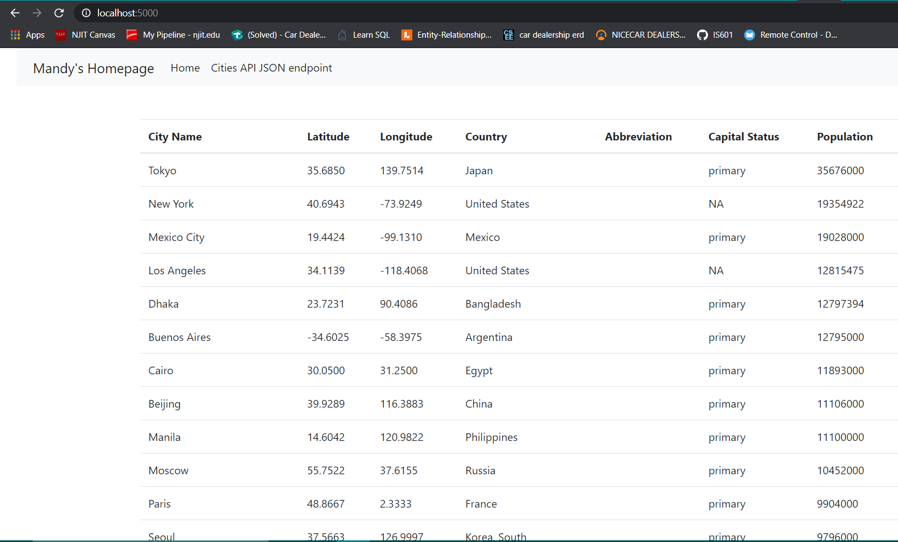

# Flask_MySql_Templates

# Project Title
## PythonDockerFlaskPycharm.Templates

# Project Description
## This project is being created as a part of the Homework: Web Application Part 2 to introduce working with html templates

# Images
## 